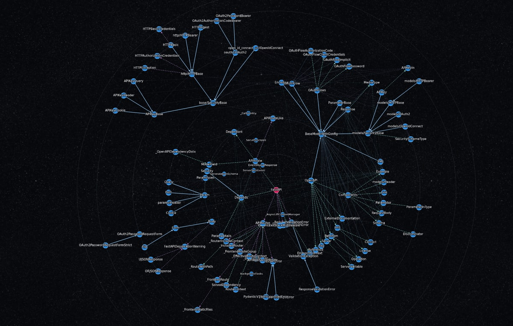
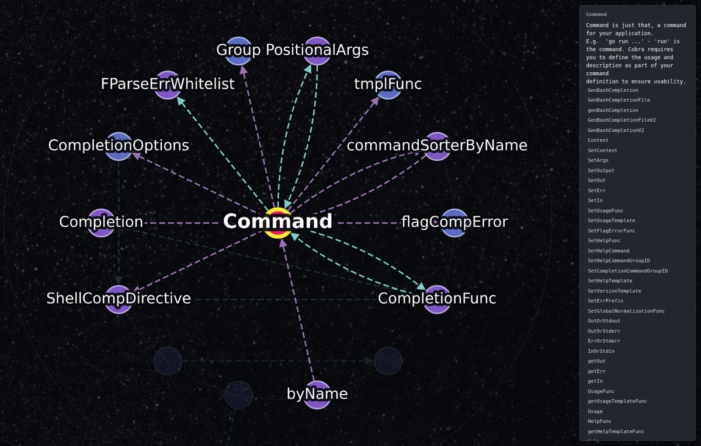
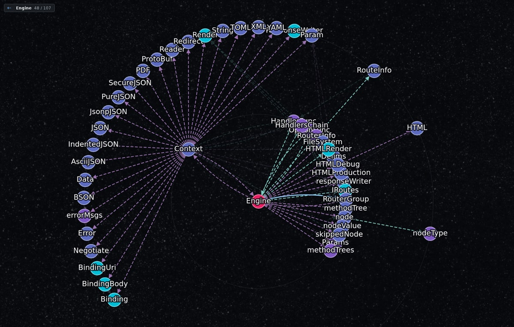

# Planisphere

Read a codebase as one drawing. Planisphere draws the types of a **Python**,
**TypeScript**, **Go**, **Rust** or **Java** project as a radial map, and a click
on any of them takes you to its source.



<sub>FastAPI, drawn from its own source. The red node is where the graph starts;
solid lines are inheritance, dashed ones are uses.</sub>

## Getting started

1. Install **Planisphere** from the Extensions view of VS Code or Cursor.
2. Right-click a folder in the Explorer and choose **Planisphere: Analyze
   Folder**, or run the same command from the Command Palette.
3. Planisphere writes `planisphere.json` into that folder and opens it as a
   drawing. Where the folder holds more than one language, it asks which.

The file is the drawing: open it again later and it is drawn without analysing
anything again. Run the command again after the code changes to bring it up to
date. The paths in it are absolute, so a drawing made on another machine opens,
but jumps to the source only where the project sits at the same path.

## What each language needs

**Opening a drawing needs nothing at all.** **Making one needs nothing for
TypeScript or Go**, and the language's own toolchain for the other three.
Planisphere reads the project's source and never downloads its dependencies.

| Language | Needs | Why |
| --- | --- | --- |
| TypeScript | nothing | the compiler ships with the extension and runs on the editor's own Node |
| Go | nothing | the analyzer ships compiled for Linux, macOS and Windows |
| Rust | `cargo` | `syn`'s source ships with the extension and is built once, offline, on first use |
| Python | Python 3, as `python3` or `python` (`py` on Windows) | the standard library's `ast` |
| Java | `java` 21 or later, from a JDK | the runtime's own compiler module, `jdk.compiler` |

A toolchain installed where the editor does not look, such as `~/.cargo/bin` in
an editor started without your shell's profile, is still found. Where one is
missing, Planisphere says which, and what to install.

## Reading the drawing



<sub>cobra's `Command`, clicked once: what it touches stays lit, and the panel
shows the comment above it and its methods.</sub>

- **Click** a node to focus it: what it touches stays lit, the rest dims, and the
  panel shows the comment above its definition and its members, or a group's
  members. **Click it again** to jump to its source.
- **Click** empty canvas or an edge to clear the focus.
- **Right-click** a node to see only what it points to, two steps out.
  **Escape**, or the **←** button above the drawing, returns to the whole drawing.
- **/** searches by name, members included; **Enter** moves to the next match.
- **F** fits the whole drawing. **C** makes the focused node the centre; press
  it again on the centre to hand the choice back.
- The rail on the left shows or hides functions, resets the view, opens the
  settings (which kinds are drawn, and their colours), exports the drawing as a
  PNG beside the artifact, and opens the legend, which names every mark the
  drawing makes.



<sub>gin's `Engine`, right-clicked: everything else is put away, and what is
left is what `Engine` points to and what those point to. The strip at the top
left says where you are and takes you back.</sub>

Edges are `contains`, `inherits`, `uses` and `references`; the legend shows how
each is drawn. To see the file as JSON, right-click it and choose **Open With…**
→ **Text Editor**.

## Without the editor

The `planisphere` command line in this repository writes the same file, for a
script or a CI job:

```bash
planisphere                              # ./planisphere.json for the current directory
planisphere /path/to/project
planisphere -o go.planisphere.json       # any *.planisphere.json opens as a drawing
planisphere --lang go /path/to/module    # name the language when a repository holds more than one
planisphere --stdout
```

[CONTRIBUTING.md](CONTRIBUTING.md) says how to put it on your `PATH`.

## The name

A planisphere is a star chart that flattens the sky onto one rotating disc, so
that you can see at a glance what is overhead. Planisphere does the same for a
codebase: it flattens a tangle of modules and types into one drawing, laid over
a starfield.

Its mascot is a dog named Sirius, after the Dog Star, the brightest star on any
planisphere.

## Contributing

Building from source, running an analyzer by hand, and the test suites are in
[CONTRIBUTING.md](CONTRIBUTING.md).

## License

[MIT](LICENSE)
