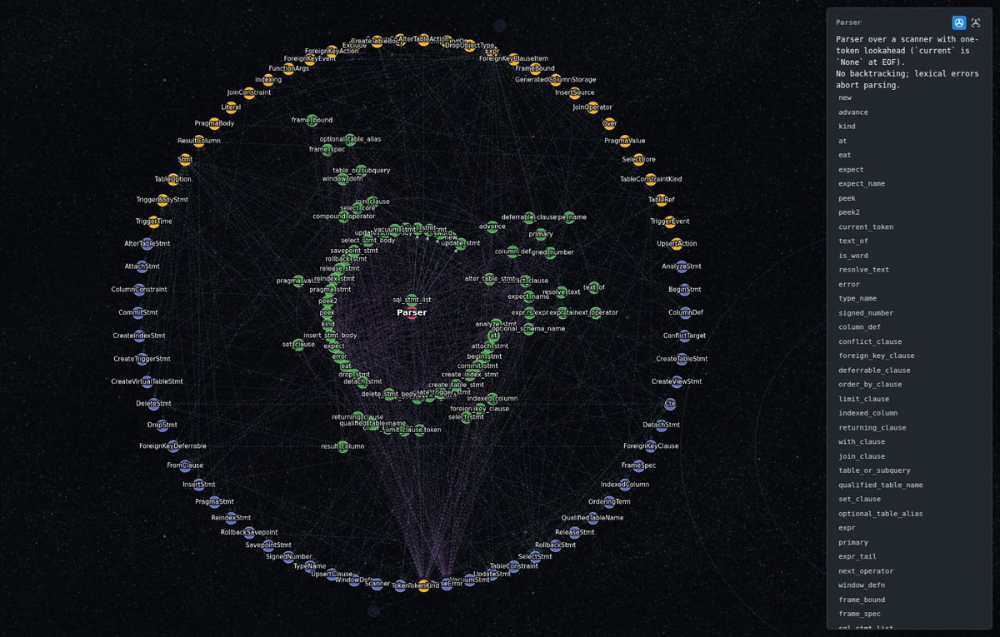

# Planisphere 🌠 — Read a codebase as one drawing


<p align="center">
  <a href="LICENSE"></a>
  <a href="https://code.visualstudio.com/"></a>
</p>

Planisphere draws a project's types as a radial map. Click one to open its source.

It is early: this is 0.x. The drawing and the `planisphere.json` it is made
from may still change between versions, and a file written by one version may
need writing again by the next. What you draw with it is what decides what
changes — [open an issue](https://github.com/smid191394/planisphere/issues)
with the picture.


<sub>FastAPI, from its own source, with its functions shown. Blue is a type and
green a function; the red node is where the drawing starts; solid lines are
inheritance, dashed ones are uses.</sub>

## Getting started

1. Install **Planisphere** from the Extensions view of VS Code or Cursor.
2. Right-click a folder in the Explorer and choose **Planisphere: Analyze Folder**.
3. It writes `planisphere.json` there and opens it as a drawing. A folder with
   more than one language asks which.

Open that file any time and it draws without analysing again; run the command
again when the code has moved on. Its paths are absolute, so a drawing made
elsewhere opens, but jumps to source only where the project sits at the same
path.

## What each language needs

Opening a drawing needs nothing. Making one needs nothing for TypeScript or Go,
and the toolchain you already have for the other three. Nothing is downloaded.

| Language | Needs | Why |
| --- | --- | --- |
| TypeScript | nothing | the compiler ships with the extension |
| Go | nothing | the analyzer ships compiled for Linux, macOS and Windows |
| Rust | `cargo` | `syn` ships as source and is built once, offline |
| Python | `python3`, or `python` (`py` on Windows) | the standard library's `ast` |
| Java | `java` 21 or later, from a JDK | the runtime's own `jdk.compiler` |

A toolchain your shell finds but the editor does not is still found, and a
missing one is named.

## Reading the drawing


<sub>cobra's `Command`, clicked once.</sub>

- **Click** a node: what it touches stays lit, and the panel shows the comment
  above it and its members. **Click again** to jump to the source.
- **Right-click** a node: only what it points to, two steps out. **Escape**
  comes back. Clicking empty canvas clears the focus.
- **Open a type**: the button beside its name in the panel, or **E**, draws a
  type's methods as the tree their calls make, around the type where it stands
  — the rest of the project moves outward to make room, and each line to it
  starts at the method that names it. The one beside it, or **M**, draws that
  tree alone. A method's place says how few calls it is from the way in, not
  whose it is: one called from twenty places is drawn beside one of them, and
  the lines from all twenty are drawn.
- **/** searches, members included, and **Enter** moves to the next match.
  **F** fits the drawing; **C** makes the focused node the centre.
- The rail on the left hides functions, resets the view, opens the settings and
  the legend, and exports the drawing as a PNG beside the artifact.


<sub>ripgrep's `SearcherBuilder`, right-clicked: what it points to grows above
it, and the strip at the top left takes you back.</sub>



<sub>sqlparser-ranger's `Parser`, opened: its methods are the grammar it
follows — `sql_stmt_list` beside the type, the statements around it, the
clauses beyond — and the types they build make room around them.</sub>

Edges are `contains`, `inherits`, `uses` and `references`; the legend shows how
each is drawn.

## Without the editor

The `planisphere` command line writes the same file, for a script or a CI job:

```bash
planisphere                              # ./planisphere.json for the current directory
planisphere -o go.planisphere.json       # any *.planisphere.json opens as a drawing
planisphere --lang go /path/to/module    # when a repository holds more than one
planisphere --stdout
```

[CONTRIBUTING.md](CONTRIBUTING.md) says how to put it on your `PATH`.

## The name

A planisphere is a star chart that flattens the sky onto one rotating disc, to
show what is overhead. This does the same for a codebase.

The dog is Sirius: the brightest star on any planisphere, and the one every
stargazer finds first.

## Contributing

Building from source, running an analyzer by hand and the test suites are in
[CONTRIBUTING.md](CONTRIBUTING.md).

## Credits

The drawings on this page are of [FastAPI](https://github.com/fastapi/fastapi)
(MIT), [cobra](https://github.com/spf13/cobra) (Apache-2.0) and
[ripgrep](https://github.com/BurntSushi/ripgrep) (MIT). Their code and their
names belong to their authors, and neither project is connected to this one.

## License

[MIT](LICENSE)
