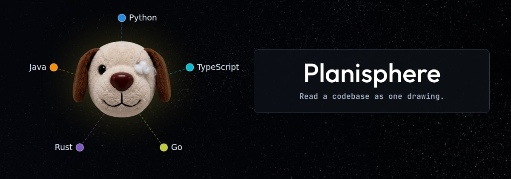
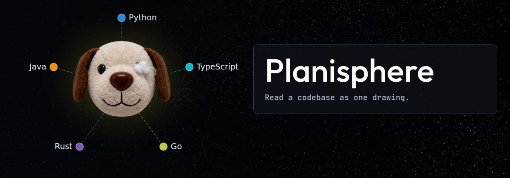
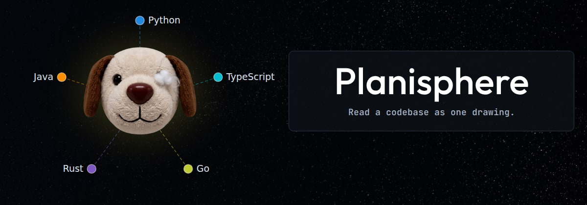
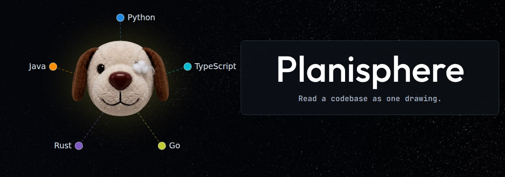

# Centred, and larger — pick one

The panel sits at the same place in all of them, as close to the drawing as the
`TypeScript` label allows. Temporary: this file and its images go once one is
chosen.

## mid — 62px, centred

## big — 76px, ranged left

## bigmid — 76px, centred

## huge — 86px, centred, the panel widened to take it

The name is as large as the panel will hold without crowding its edges.

