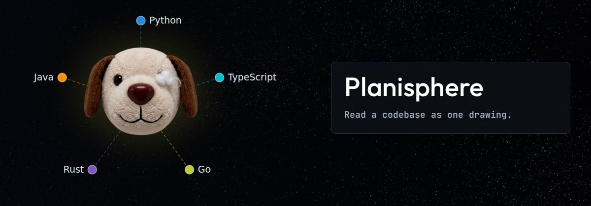
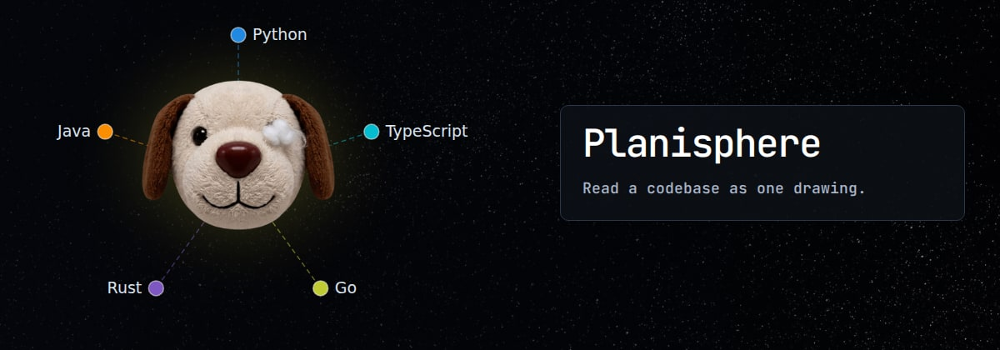
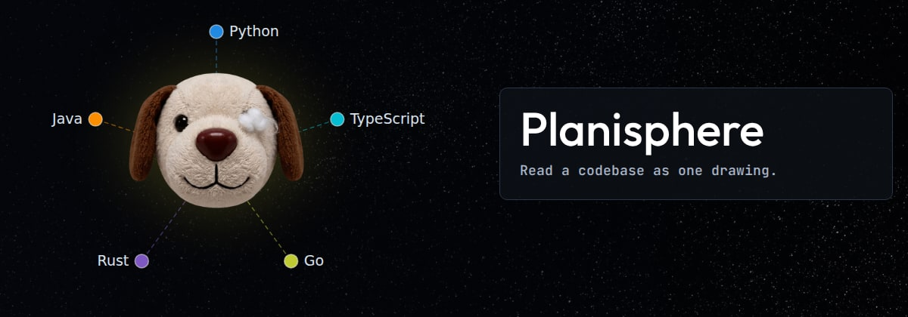

# The panel, with the name big and one line under it — pick one

The two lines about the languages and about clicking are gone: the nodes on the
left already name the languages. Temporary: this file and its images go once
one is chosen.

## p1 — name at 54px, in Outfit

## p2 — the whole panel in its own monospace

## p3 — name at 62px, the line tucked under it

