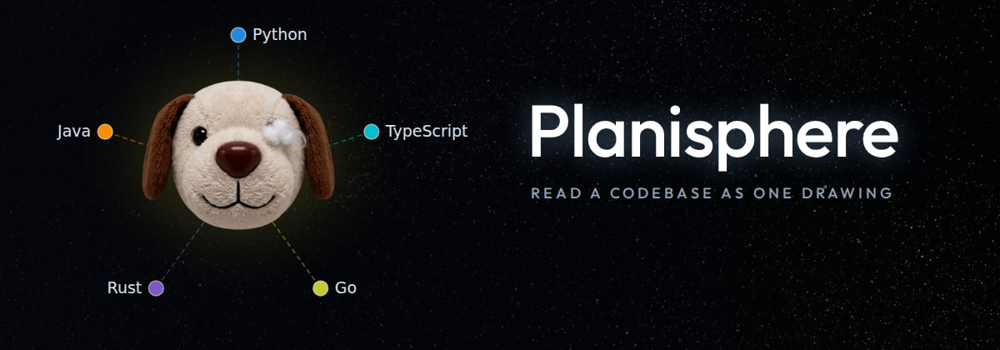
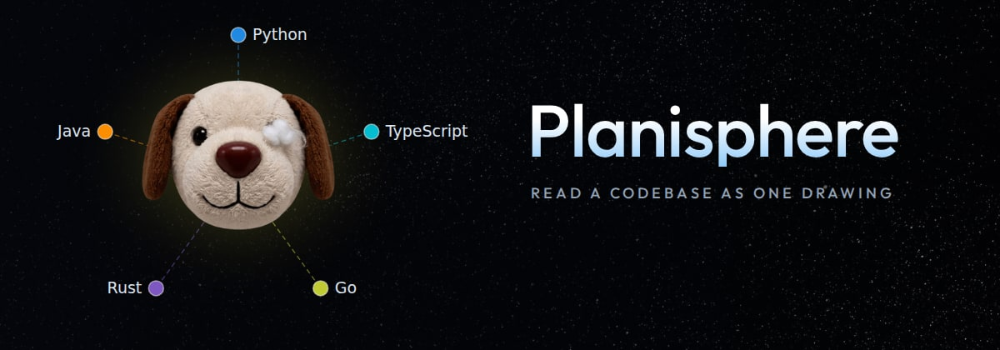
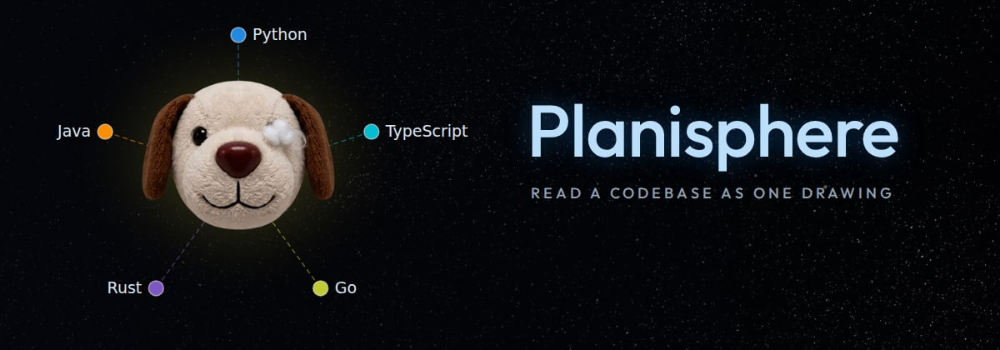
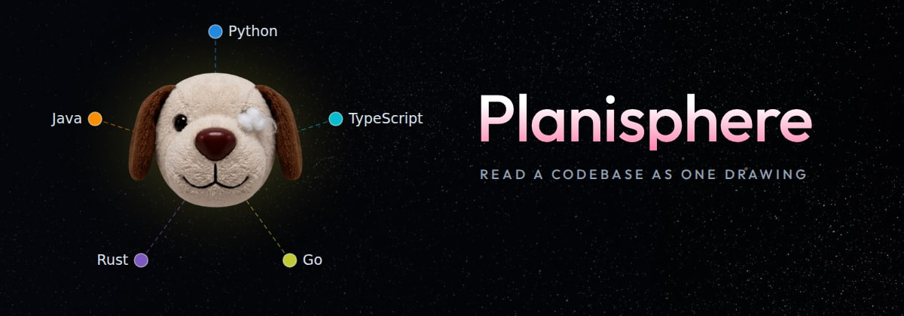

# The name at 88px, four colours — pick one

Same size and place in all four. Temporary: this file and its images go once one
is chosen.

## glow — white, with the halo a bright star has

## bluegrad — white above, the blue of a class below

Sirius is a blue-white star, and this is the drawing's own blue.

## blue — the class blue throughout

## pink — white above, the colour a drawing's centre carries below

