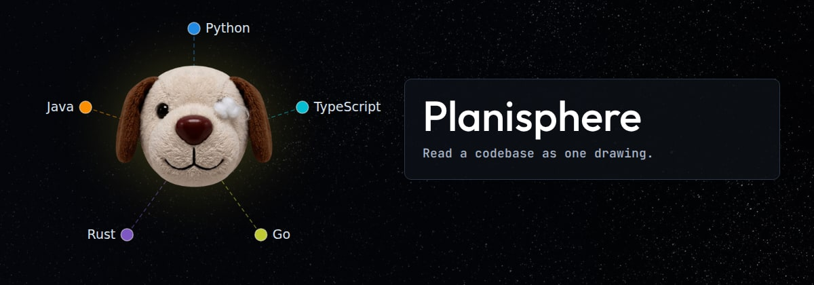
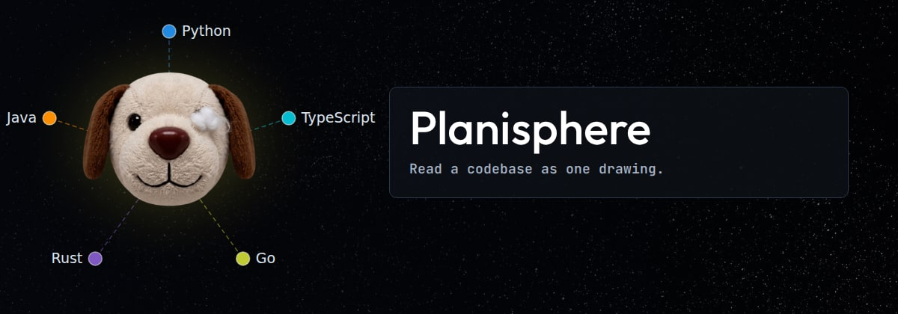

# How close the panel can come — pick one

Both have the name at 62px and one line under it. Temporary: this file and its
images go once one is chosen.

## near — the drawing stays, the panel comes as close as the labels allow

Any closer and the panel covers the end of `TypeScript`.

## shift — the drawing moves left too, so the two sit together

More room between the pair and the right edge, and the mascot is nearer the
corner.

