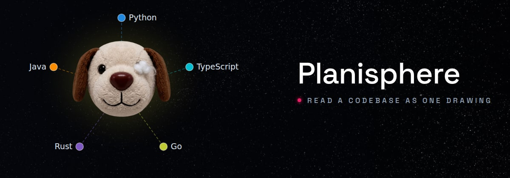

# Two ways to set the name — pick one

Temporary: delete this file and both images once chosen.

## B — Space Grotesk

Angular, technical. `a`, `e` and `r` are cut at an angle, which reads as
engineering rather than as friendliness.

## C — Outfit

Geometric and round, the same shapes as the mascot's head and the nodes.

Both: the tagline is grey rather than pink, with a pink node opening it — the
colour a drawing's centre carries.
