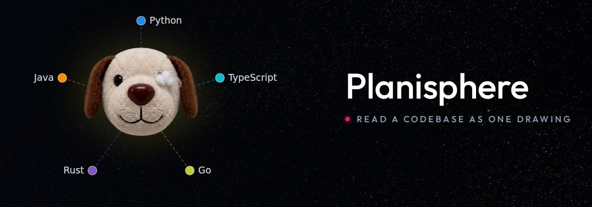
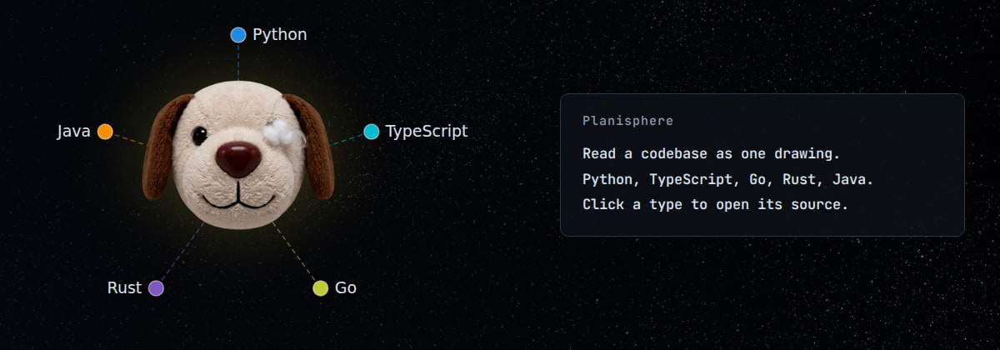
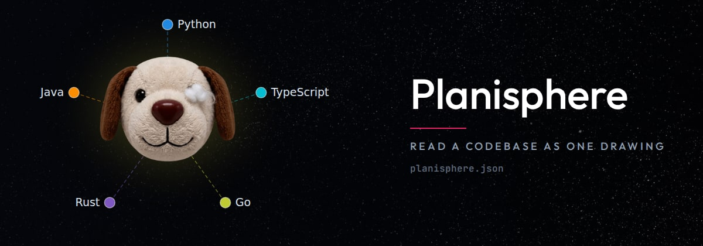
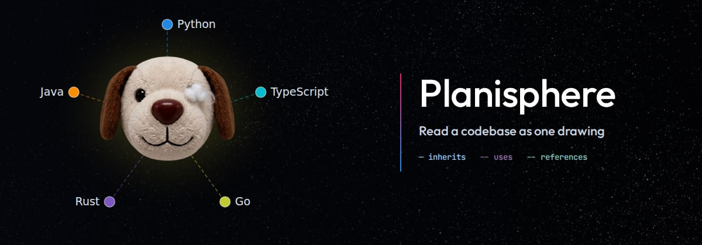

# Four ways to set the right-hand side — pick one

The mascot and the five language nodes are the same in all of them. Temporary:
this file and the four images go once one is chosen.

## 1 — Name and tagline

What is there now, in Outfit, with the tagline quieter and a node opening it.

## 2 — The viewer's own panel

The right side is the panel the viewer shows when a node is focused, holding
what the product is instead of a comment. Everything in it is the panel's
monospace, as the product draws it.

## 3 — Name, rule, and the file

A rule in the centre's colour under the name, and below the tagline the file
the drawing is: `planisphere.json`.

## 4 — Hung off a rail

The words hang off a rail like the viewer's own, and under them the three edge
kinds are named in the colours and dashes the drawing uses.

