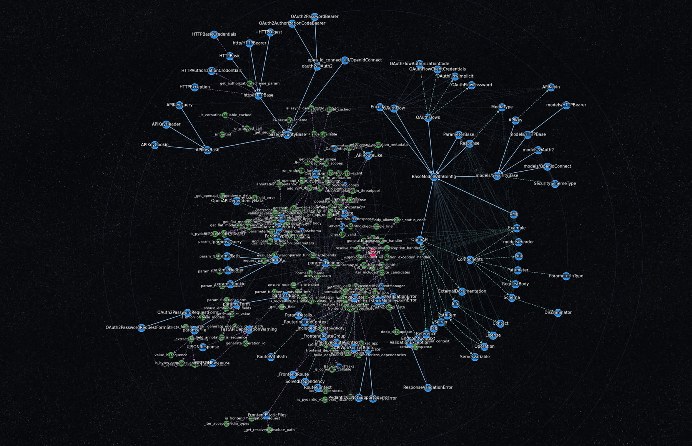
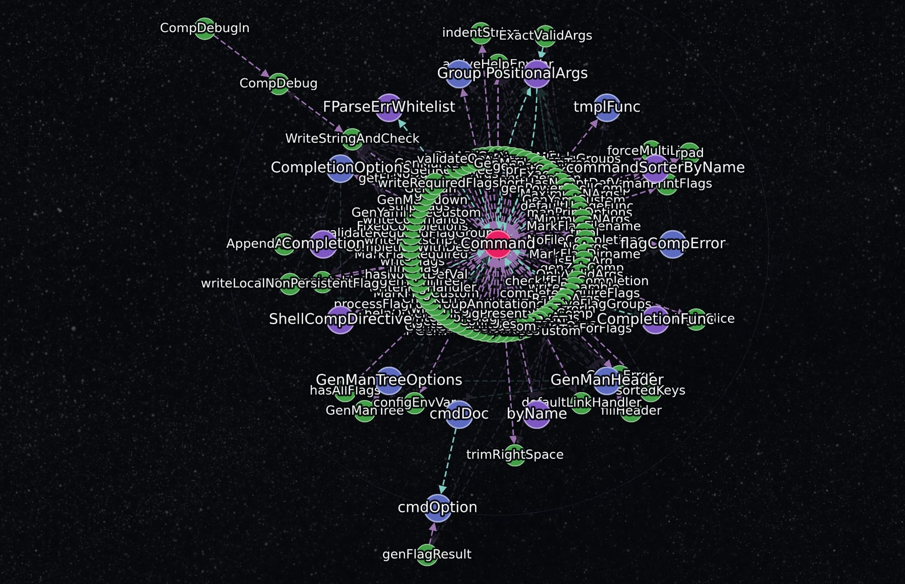
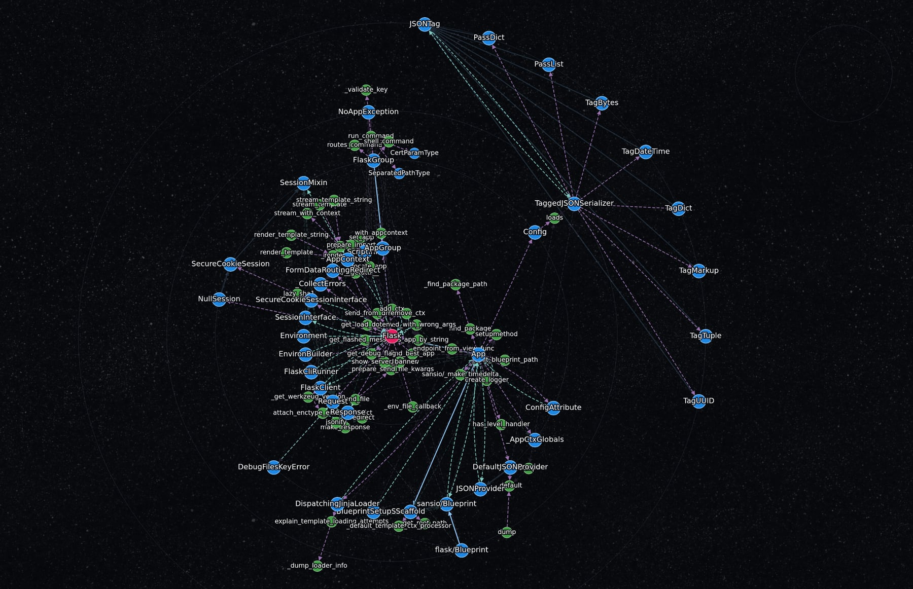

# What the drawing looks like with functions shown

Temporary: this file and its three images go once they have been looked at.

Functions are hidden by default; the rail's first button shows them. Green is a
function. Click an image to see it at full size.

## FastAPI — 116 types, 150 functions

## cobra — the methods of `Command` ring its centre

## flask — small enough that the functions stay beside what they belong to

