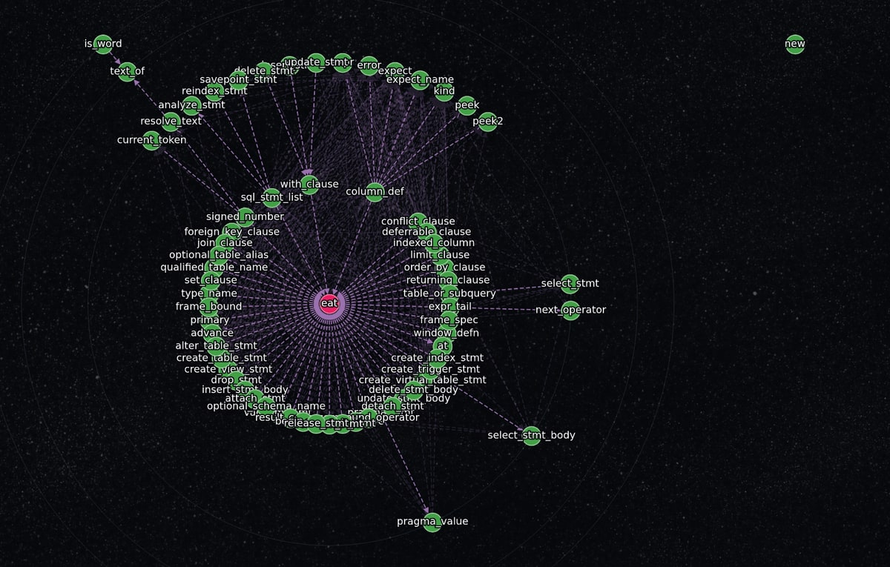
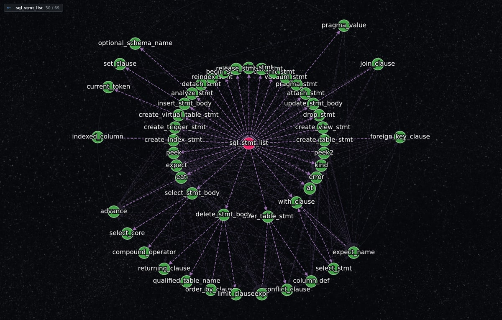

# What a view of one type could look like

Temporary: this file and its two images go once they have been looked at.

Both are mocks, drawn from real data: the 69 members of sqlparser-ranger's
`Parser`, and which of them call which. The calls were found by looking for
`self.<name>(` in each method's body — enough for a picture, not how it would
be done.

## The whole type as one drawing

The centre comes out as `eat`, a one-line helper that every rule calls. The
structure the parser is built from is behind it.

## From the entry, outward

The same drawing, right-clicked on `sql_stmt_list` — 50 of the 69. Now it reads
as what it is: the entry, and under it `create_table_stmt`, `select_stmt`,
`update_stmt_body` and the rest, every one named after the rule it parses.

## What the pair says

A view of one type works, and the centre cannot be chosen the way the main
drawing chooses one. Inside a type, what a reader wants at the middle is the
way in — a member nothing else in the type calls — not the member with the most
lines running to it.
