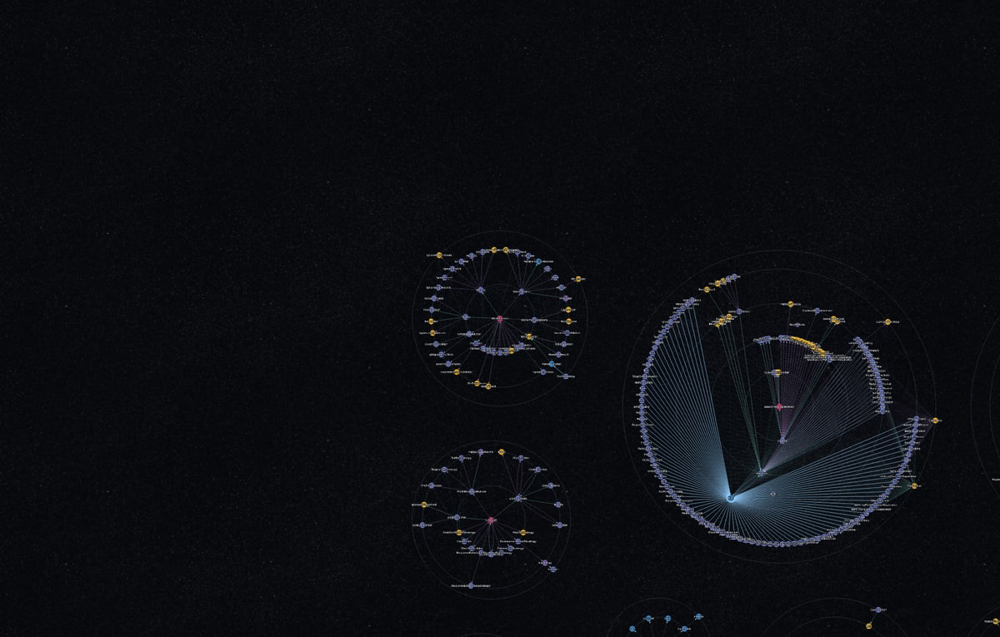
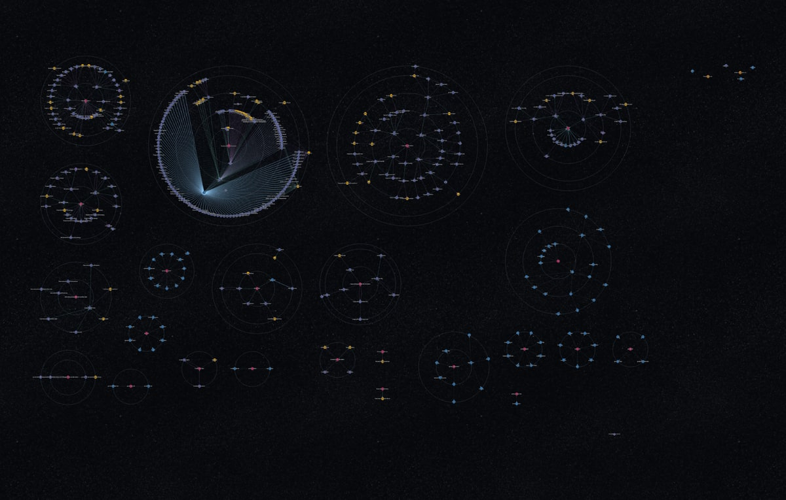

# The opening view on a large drawing

Temporary: this file and its two images go once they have been looked at.

## What ripgrep looks like when it opens

Three groups, and the left half of the window empty.

## What the whole drawing is

About twenty-five groups. Framed like this every label is far too small to read,
which is why the viewer does not do it.

## So what is wrong

Nothing about stopping. The viewer frames the whole drawing unless that would
take labels below the size the reader has set, and ripgrep is past that; it
stops at the floor, which is the rule working.

What is wrong is where it stops: centred on the drawing's own centre, which
leaves the window half empty when the drawing spreads to one side. Stopping at
the floor should still fill the window with drawing.
